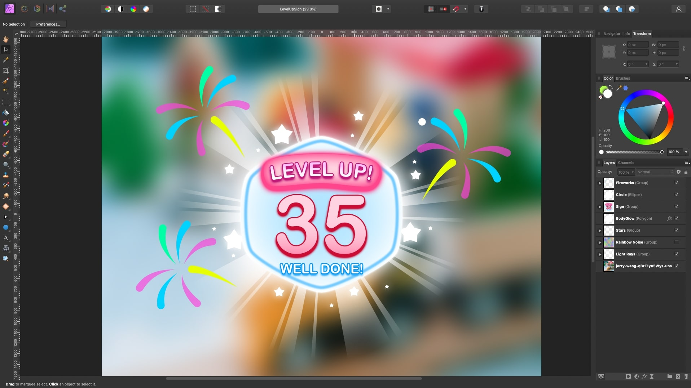
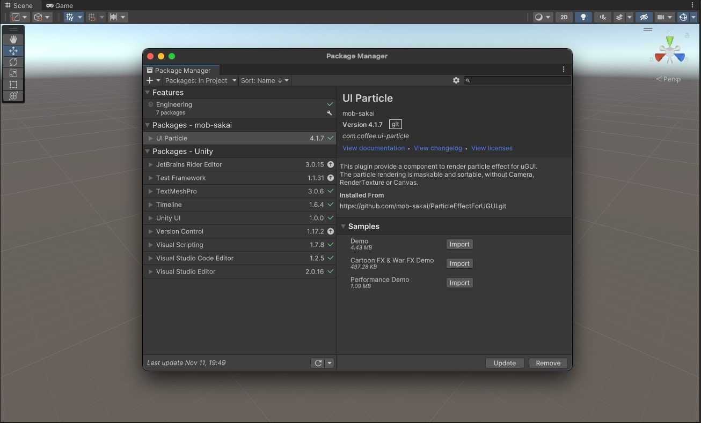

# Stars and Fireworks UI VFX

Implemented with Shuriken Particle System in **Unity 2021.3.10f1**

## Screenshots

### Table Of Content

- [Implementation](#implementation)
  - [Design UI Elements](#design-ui-elements)
  - [Install the UI Particle Package for Particle Systems in the GUI](#install-the-ui-particle-package-for-particle-systems-in-the-gui)

### Resources

- [Fireworks and Stars | Unity Tutorial by Jettelly](https://www.youtube.com/watch?v=mCM2BwZbuwY)
- [ParticleEffectForUGUI by Mob-Sakai](https://github.com/mob-sakai/ParticleEffectForUGUI)
- [Fireworks VFX by Aqsa Nadeem](https://www.youtube.com/watch?v=1o4PMeao9kA)
- [ShaderLab Blend](https://docs.unity3d.com/Manual/SL-Blend.html)
- [Background Image](https://unsplash.com/photos/qBrF1yu5Wys)

## Implementation

### Design UI Elements

- Design the UI elements in Affinity
  - Main Sign for the "Level Up" message
  - Glow effect around the Sign
  - Rays of Light behind teh Sign
  - Stars for the particle emitter
  - Circles for the fireworks emitters

### Install the UI Particle Package for Particle Systems in the GUI

- Install the package using the github url from this repo https://github.com/mob-sakai/ParticleEffectForUGUI
- This will allow to render particles from the particle system in the UI Canvas, using a CanvasRenderer.

