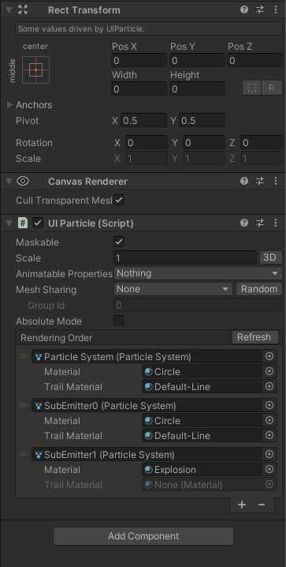

# Stars and Fireworks UI VFX

Implemented with Shuriken Particle System in **Unity 2021.3.10f1**

## Screenshots

### Table Of Content

- [Implementation](#implementation)
  - [Design UI Elements](#design-ui-elements)
  - [Install the UI Particle Package for Particle Systems in the GUI](#install-the-ui-particle-package-for-particle-systems-in-the-gui)
  - [Rainbow Light Rays and Outer Glow](#rainbow-light-rays-and-outer-glow)
  - [Stars Particle System](#stars-particle-system)
  - [Animation for Light Rays and Sign](#animation-for-light-rays-and-sign)
  - [Fireworks Particle System](#fireworks-particle-system)

### Resources

- [Fireworks and Stars | Unity Tutorial by Jettelly](https://www.youtube.com/watch?v=mCM2BwZbuwY)
- [ParticleEffectForUGUI by Mob-Sakai](https://github.com/mob-sakai/ParticleEffectForUGUI)
- [Fireworks VFX by Aqsa Nadeem](https://www.youtube.com/watch?v=1o4PMeao9kA)
- [ShaderLab Blend](https://docs.unity3d.com/Manual/SL-Blend.html)
- [Background Image](https://unsplash.com/photos/qBrF1yu5Wys)
- [ZTest for GUI Shaders](https://support.unity.com/hc/en-us/articles/115000531226-What-is-the-value-of-shader-ZTest-mode-unity-GUIZTestMode-)

## Implementation

### Design UI Elements

- Design the UI elements in Affinity
  - Main Sign for the "Level Up" message
  - Glow effect around the Sign
  - Rays of Light behind teh Sign
  - Stars for the particle emitter
  - Circles for the fireworks emitters


### Install the UI Particle Package for Particle Systems in the GUI

- Install the package using the github url from this repo https://github.com/mob-sakai/ParticleEffectForUGUI
- This will allow to render particles from the particle system in the UI Canvas, using a CanvasRenderer.


### Rainbow Light Rays and Outer Glow

#### Rainbow Lights

- Add an Image to the Canvas.
- Create a Shader for it and a Material.
- Set the Shader to use:
  - `Queue=Transparent` and `RenderType=Transparent`, because we want to blend the alpha
  - `ZWrite Off` because it's a transparent object, we don't want it to write to the z buffer.
  - `ZTest [unity_GUIZTestMode]` because this is a custom shader for a UI element.
  - `Cull Off` because we don't want to cull any geometry.
  - `Lighting Off`, we don't need any lighting calculation.
  - `_MainTex ("Sprite Texture", 2D) = "white" {}` to accept the main texture the sprite will use to render.
  - `_RainbowTexture("Rainbow Texture", 2D) = "white" {}` to accept a rainbow texture that will get multiplied on top.
  - Animate the uv coordinates of the rainbow texture using `_Time`.
  - `Blend One One` to make it additive.
    - This means we need to manually multiply the `rgb` channels by the alpha channel of the original sprite.
    - Since the result of the fragment shader will just get added to the frame buffer value. We can't just pass in the raw `rgb` values, otherwise it will just get simply added to whatever was in the frame buffer and break the transparent effect.

```c
Shader "Unlit/Rainbow"
{
    Properties
    {
        _MainTex ("Sprite Texture", 2D) = "white" {}
        _RainbowTexture("Rainbow Texture", 2D) = "white" {}
    }
    SubShader
    {
        Tags {
            "Queue"="Transparent"
            "RenderType"="Transparent"
        }

        Cull Off
        ZWrite Off
        ZTest [unity_GUIZTestMode]
        Lighting Off

        Blend One One
```

```c
fixed4 frag (v2f IN) : SV_Target
{
    // animate uvs for rainbow
    float2 rainbowUV = frac(IN.uv_Rainbow + (_Time.y / 2));

    // sample the texture
    fixed4 spriteColor = tex2D(_MainTex, IN.uv);
    fixed4 rainbowColor = tex2D(_RainbowTexture, rainbowUV);

    fixed4 multipliedColor = spriteColor * rainbowColor; // multiply
    multipliedColor *= spriteColor.a; // so that the blending one one works ok

    return multipliedColor;
}
```

#### Outer Glow

- Create a Material for it using the `UIAdditive` shader included in the `UI Particle` package.
- Assign it to the image renderer.


### Stars Particle System

- Create a `UIParticle` gameobject with a nested Shuriken `Particle System` to be able to render particles with the Canvas Renderer.
- Add the `Particle System` to the `UIParticle` object renderer's list, so it creates the `UIParticleRenderers` for it.
- Set `Start Lifetime`, `Start Speed`, `Duration`, `Start Size` and `Rate Over Time`.
- Set `Color over Lifetime` and `Size over Lifetime`.


### Animation for Light Rays and Sign

- Add an Animator Controller and an Idle animation to the Prefab.
- Rotate the Light Rays.
- Implement a heartbeat animation for the Sign.

<!-- 8.mp4 -->

https://user-images.githubusercontent.com/4588601/201554488-967e98d2-3539-43e2-aa18-abbbce957e04.mp4

### Fireworks Particle System

- Create a `UIParticle` gameobject with a nested Shuriken `Particle System` to be able to render particles with the Canvas Renderer.
- Add the `Particle System` to the `UIParticle` object renderer's list, so it creates the `UIParticleRenderers` for it.
- Use the main particle system to burst 3 particles that will act as the main firework particle.
- Use trails for the particles.
- Use sub emitters to display an explosion and to burst more particles out of the explosion, with trails too.
- Be sure to have a single `UIParticle` parent object that will manage all child particle systems rendering.




